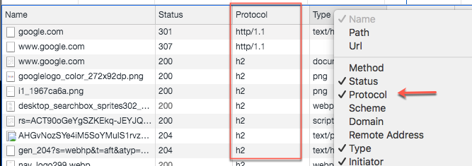

# http2使用

nginx 配置了http2有一段时间，使用http2的多路复用为了解决 http1.1管道化的队头阻塞，可以并行多个请求和响应。

对于性能测试，推荐网站 https://www.webpagetest.org/

想要在chrome查看使用http-x，可以在 网络选择卡上选择 Protocol ，通过 Protocol 查看


### 开启之后对比
http1:

<image src="../images/http2.png" style="width:50%" />

http2:

<image src="../images/http3.png" style="width:50%" />

压测对比:

<image src="../images/http4.png" style="width:50%" />

### 配置 server push
服务端主动向客户端推动内容，如同“prefetch”。
```
server {
	listen 443 ssl http2
	
	http2_push_preload on
	loacation {
		http2_push /styles.css
	}
}
```
- 需要遵守同源策略
- 注意缓存

浏览器由于缓存的存在，即使推送了也只会使用缓存，浪费带宽。
避免缓存只设置首次推动，根据cookie判断是否是第一次访问。

```
server {
	location = /demo.html {
			add_header Set-Cookie "session=1";
			add_header Link $resources;
	}
}

# 避免缓存只设置首次推动，根据cookie判断是否是第一次访问
map $http_cookie $resources {
    "~*session=1" "";
    default "</style.css>; as=style; rel=preload";
}
```
